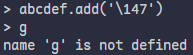
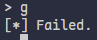
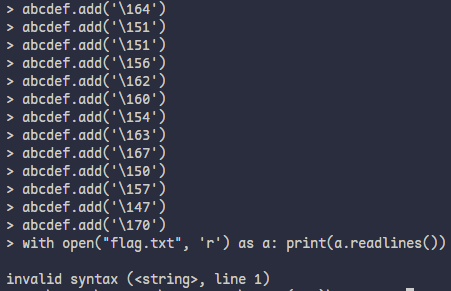
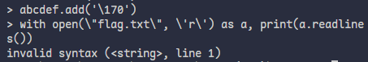
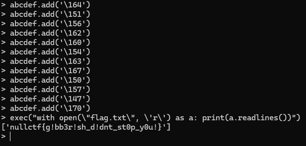

# abcdef - nullCTF2025
###### The Grand Arcanist has severed the ley lines of syntax. A silence spell hangs heavy over the terminal, choking out all complex commands. The only magic that permeates the barrier is the Hex, the alphabet of the machine spirit. The interpreter will hear nothing but the six sacred runes: a, b, c, d, e, f. Can you conjure a flag from the silence? - 50 Points, 130 solves.

### TL;DR - Just Give Me the Solve!
Python jail challenge that restricts input to just the letters abcdef along with all numbers and punctuation. Solve: add strings using an octal escape character to add letters into the set of letters you can use (ex: abcdef.add("\167")). After, call exec to then be able to open the flag.txt file on the server.

### Introduction
I randomly decided to do this CTF since I didn't have a ton to do, and just wanted to see if there were any interesting challs. Fortunately for me, this one seemed interesting and like something I could do, given I've got decent python skills.

### Analysis
As with any challenge, the first step is analyzing any files and tools they give you. In this case, all I needed to look through was a very short python file:

```python
abcdef = set("abcdef")

def is_valid(text):
    for c in text:
        if ord(c) < 32 or ord(c) > 126:
            return False
        if c.isalpha() and c not in abcdef:
            return False
    return True

try:
    while True:
        x = input("> ")
        if is_valid(x):
            eval(x)
        else:
            print("[*] Failed.")
except Exception as e:
    print(e)
```

While this might look a little intimidating with the usage of ord(), it's fairly simple: The user inputs some python code to run in eval(). The program then checks every character in the input for it's unicode code to make sure it's a standard number, letter, or punctuation. Then, if it's a letter, it checks to see if the letter is contained in the global var abcdef, which contains the letters we're allowed to use. At first glance, there are two simple paths I could've gone down: 
1) Try and use a built-in function that would allow me to open a file in some unintended way.
2) Figure out a way to add letters into the abcdef set.

My first thought was that this would be a neat challenge that required me to use some obscure function or way that python worked, something akin to [GoogleCTF's onlyecho](https://ctftime.org/task/28613). So, I started researching, but only came up on dead ends. It was at this point I decided that the second option would be more worth looking into just for a second - maybe the function you needed to do in order to add something to the set would fit nicely into the 6 letters I was allowed to use.

### Adding Values to the set
My thought was right: adding a value into a set is `python set_var.add()`. And, fortunately for me, the set variable is only made up of the letters I can use as well. Thinking it'd be pretty easy, I simply typed in the command `abcdef.add("g")`. That got shut down, since g isn't in the included letters and I felt a little silly. But then I thought back to how python handles strings, and thought I could try and sneak it in using a different representation using [escape codes](https://www.w3schools.com/python/gloss_python_escape_characters.asp). Initally, I wanted to use hex, but the form requires you to format it as `"\xhh`(where hh is the hex code). Then, I realized that I could use octal, since it just uses three numbers in it's format. So, I tried `abcdef.add('\147')` to insert the letter g, and...


Even though I'm not getting anything back, this is a great sign - it means that it's been added to the set! Now, lets see what happens when I put in the letter g:


This might look like a failure, but it's not: what this means is that the letter g has successfully been injected into the set! If it wasn't this is how the input would look:


So, with that in mind, let's craft the payload.

### Payload crafting
Since we need to get the flag from a text file in the same folder as where the python file is being run, we can just do something simple like `with open("flag.txt", 'r') as a: print(a.readlines())`. The only issue is, we need to inject all of the characters so we can write this. How I did this was that I got the letter frequency of all of the letters in that command, and then got the octal codes for each letter. From there, I generated all of the injection commands using python and realized I should probably automate this. Unfortunately for me, I am horrible with socket and pwntools, and after about an hour of attempting to simply send a command and receive a reply with zero results, I resorted to just doing this by hand. I altered my code to print out all of the injection commands, and copied them over one by one and ran my payload:


This sucked, but then I realized I was doing this in a silly way: since my input was turned into a string, I'd need to escape the quotes on it so it didn't destroy the string. This will definetly work!


After seeing this, I thought there was something wrong with me, but I decided to try and replicate this on my machine. So, I made a quick script to run this code through eval() and found that eval doesn't like opening a file. However, I did know there was another python function that let you run whatever code you wanted: exec(). [Here's a good explaination on the difference between these two similar functions.](https://stackoverflow.com/a/29456463) So, I did what any person would do, and put some code in an exec function which I called using eval (like `eval(exec("some code here"))`).

Since I knew from before I had to escape all of my quotes, I made sure to escape them for this time around. And then, I tried again:


This frustrated me and confused me to no end, so I made a quick script to run stuff in eval() offline without having to go through all the setup. At some point while testing, I realized I might not have to actually cancel out the quotes and the backslashes in the exec function call. And so, I ran my newly crafted payload of `exec("with open(\"flag.txt\", \'r\') as a: print(a.readlines())")`.



Still not really sure why that works given how everything's getting processed, but it worked and I got the flag `nullctf{g!bb3r!sh_d!dnt_st0p_y0u!}`

### Final Thoughts

So, what to draw from this chall? The main takeaway is that eval() and exec() can be used in tandem and in devestating ways. Additionally, it's good to check and make sure that you cannot access global variables if you do give users this sort of access.

One other thing I thought of after the challenge is that you could get access to exec, and then add all of the letters of the alphabet into it by making the abcdef variable point to a list of all letters in octal instead of just the 6 letters. I ended up writing a script and testing, and found that it works! Ultimately, it's a much cleaner and easier to use solution compared to what I was doing:


Overall, I thought this challenge was really neat and a lot of fun to do. I'm not the best at jail challenges, but this one wasn't too hard and tested my knowledge of python.