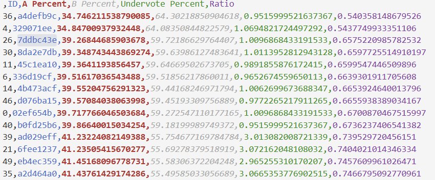
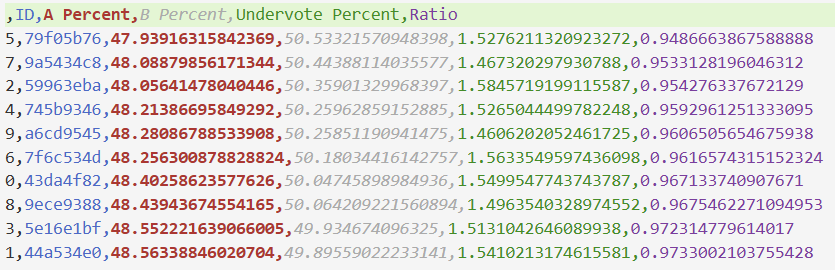
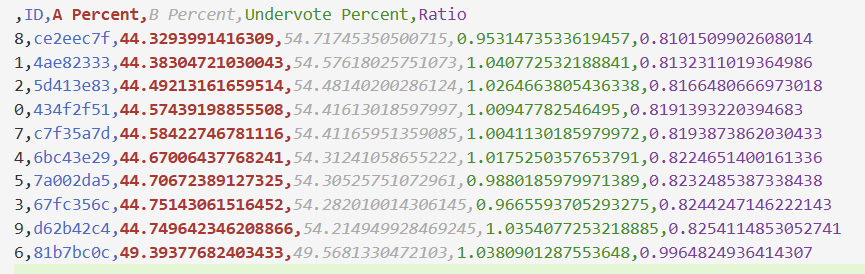

## Skillia Election Integrity

Honestly, I'm surprised this was included in a CTF. It feels way more stats based than most other things I've encountered... though I'm not a forensics expert at all. TLDR: Group the counties into their own groups, and then analyze the ratio of votes for the president in each county to find outliers.

Tools Needed:
- Python
- Pandas
- Patience for the above

 To start this CTF, you're given general instructions saying that the previous election for Skillia was very close, and that you were convinced there was some vote tampering. The government then ripped out the PII and sent the file containing the votes your way. As a stats major, when I'm analyizing a CSV file like this, I like to get familiar with the format of the original file first, so first things first, I import the libraries and the csv file.
 ```python
import pandas as pd
import numpy as np #not needed, force of habit :p

df = pd.read_csv("skillia_voting_records.csv")
 ```  
Normally, I'd check out the dataframe using `print(df.head())`, but it wasn't super easy to read in terminal, so I just checked the csv in a text editor/VSCode. Only important things of note are a few columns: county, voting_station_id, voter_type, and vote_president. I figured later on I could analyze the other columns, but these stood out to me. I didn't delete the others, but I put most of my focus on these. Leaving the others in helps speed up the process if you need to analyze them later down the line.

### Looking at Population Values

After learning the headers and what they represent, I initially thought I could just analyze the entire population at once and look for glaring issues. So, I dropped the country and state column and grouped all the values by their voting station ID:
```python
by_id = df.drop(['state', 'county'], axis=1).groupby('voting_station_id')
```
When you use pd.DataFrame.groupby(), it returns a list with the name of the group (the value the column you were grouping had, so in this case it'd be the ID for the voting station), so you can just iterate through the list, so I set that up so I could perform some additional tasks afterwards.

From there I coded a few things to analyze:
1) I first implemented a block of code to grab all of the unique vote combos from each voting station and then look for ones that had a higher percentage of votes.
    - The thought process was that if they were just duplicating votes, they'd show up in this process.
2) After that first section did not work, I then looked at the ratio of votes for Canidate A and Canidate B. I noted this down as balance but this is just a ratio: given that it was a close election, we should see similar values in counties, and ideally most of them will be close to 1.
3) I then decided to also look at the amount of votes that came in either through absentee (ie. mail in) or in person voting. Just to see the trends.

For all three of these code blocks, I made sure to get the count for each object, and then sort them. It probably wasn't necessary for number 2 and 3, but I was rushing a bit - and it won't hurt here. We can just reorganize the data later.
Here's the relevant code for this section:
```python
percentages = []
balance = []
voter_type = []
for group in by_id:
    #group[1].value_counts().reset_index().to_csv(group[0] + "counts.csv") there are like 30 groups dude this was a mistake
    #look at overall population and unique values - see if there are any outliers
    count = group[1].drop(["voter_type"], axis=1).value_counts().sort_values()
    percentage = count.max()/count.sum()
    percentages.append((group[0],percentage*100))
    #see the percentages for who voted for president
    count = group[1]["vote_president"].value_counts().sort_values()
    undervote_percent = count.iloc[0]/count.sum()*100
    a_percent = count.iloc[1]/count.sum()*100
    b_percent = count.iloc[2]/count.sum()*100
    ratio = (a_percent/b_percent)
    #this is sort of a random thing I did just to see how off balance things were - if the percentage of A and B were close, the number here should go to 1 (meaning we likely don't care about it)
    balance.append((group[0],a_percent,b_percent,undervote_percent, ratio))
    #get the percentage of in person and absentee voters
    count = group[1]["voter_type"].value_counts().sort_values()
    voter_type.append((group[0],count.iloc[0]/count.sum(),count.iloc[1]/count.sum())) #id, percent of absentee, percent of in_person
```
**Important Note!** When you use the groupby object, make sure you're calling the right thing. group[0] had the name, and group[1] has a pd.Series object (not the same as a DataFrame but similar enough for this case).

After, I turned all of the data I processed into CSV files.
```python
percentage_df = pd.DataFrame(percentages, columns=["ID", "Highest Count Percentage"])
percentage_df.sort_values(by="Highest Count Percentage", ascending=False).to_csv("highest_count_percentages.csv")
balance_df = pd.DataFrame(balance, columns=["ID", "A Percent", "B Percent", "Undervote Percent", "Ratio"])
balance_df.sort_values(by="Ratio", ascending=True).to_csv("percentage_of_votes_president.csv")
voters_df = pd.DataFrame(voter_type, columns=["ID", "Absentee Percent", "In Person Percent"])
voters_df.sort_values(by="Absentee Percent", ascending=False).to_csv("voter_turnout.csv")
```

From this, I got a few good leads. The ratio of votes *did* seem skewed for a few station IDs, and they were really low compared to where I was expecting:



Unfortunately for me... These were not the right answer. In hindsight, this never would have worked. Just looking at stations that had the lowest ratio (ie: furthest away from a 50/50 split) was never going to be a good solution, as they could influence a station to have ratio closer to 50/50. (Spoiler alert: They did that.)

### An Alternate Approach: Analyzing Groups

Given all the pandas and python I was doing, I thought back to my stats classes and realized I might be approaching this wrong. It would be a lot better to analyze this by county, rather than by looking at the entire data set. I needed a finer comb to find the issues. So, I rewrote some of my code to group by the county. From there, I went through each county and ran some of the code I ran for analyzing the individual voting stations. I omitted the first one, as I found it generally was not useful. The code is basically the same as the first half, but is pasted here for convienece. Only major thing of note: Instead of outputting one CSV file, I output a CSV file for each of the counties.
```python
counties = df.drop(["state"], axis=1).groupby('county')
for county in counties:
    balance = []
    voter_type = []
    for group in county[1].groupby("voting_station_id"):
        #see the percentages for who voted for president
        count = group[1]["vote_president"].value_counts().sort_values()
        undervote_percent = count.iloc[0]/count.sum()*100
        a_percent = count.iloc[1]/count.sum()*100
        b_percent = count.iloc[2]/count.sum()*100
        ratio = (a_percent/b_percent)
        #this is sort of a random thing I did just to see how off balance things were - if the percentage of A and B were close, the number here should go to 1 (meaning we likely don't care about it)
        balance.append((group[0],a_percent,b_percent,undervote_percent, ratio))
        #get the percentage of in person and absentee voters
        count = group[1]["voter_type"].value_counts().sort_values()
        voter_type.append((group[0],count.iloc[0]/count.sum(),count.iloc[1]/count.sum())) #id, percent of absentee, percent of in_person
    balance_df = pd.DataFrame(balance, columns=["ID", "A Percent", "B Percent", "Undervote Percent", "Ratio"])
    balance_df.sort_values(by="Ratio", ascending=True).to_csv(county[0]+"_percentage_of_votes_president.csv")
    voters_df = pd.DataFrame(voter_type, columns=["ID", "Absentee Percent", "In Person Percent"])
    voters_df.sort_values(by="Absentee Percent", ascending=False).to_csv(county[0] + "_voter_turnout.csv")
```

After all of this, I got 12 CSV files to analyze again. When I get new cleaned up data like this, I like to give things a look over to see if there's anything that looks off before I write more python. Thankfully, there were pretty clear signs that some voter booths were very different from the others that were in the same group. This is a screenshot of the Surburban County voter percentages, which shows what we should expect to see: 



All of these ratios are within a few percent/decimals of each other. Nothing too aggregious. Now, look at the Urban County voter percentages:




That last id station looks a bit off: and you'd be right. This is one of the 6 stations that they mentioned had issues. Most of the other ones were about the same level of glaring, and all had 0.1 or greater of a discrepency in the ratios. After getting all of the ids, I was able to submit the correct flag of MetaCTF{1251749b,4b45c819,1fe457e4,a4defb9c,329071ee,81b7bc0c} (note: these could be written in any order).

