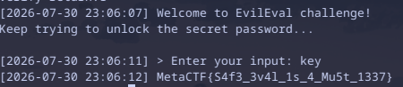
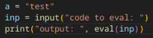
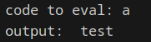
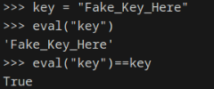

# EvilEval - MetaCTF July 2026

### Solves: 87 | Points: 200
### Description: EvilEval is billed as an escape-proof Python sandbox. Your tools are confiscated at the door, and nothing you type is meant to reach the world outside. It has held every visitor so far.

## TLDR - Give me the solve:

Simply type "key" and press the enter key.

Additional discussion on why this works can be found [here](#solution), but it's likely unintended.



## Writeup/Initial Steps

Initially, I thought this would be similar to another pyjail problem called abcdef, in which you had to use octal to add letters to the main list held in memory. I found out pretty fast that that's just not something that works, due to the checks. After, I decided to actually go through the code, as I should've done initially.

I'll be skipping going over a decent chunk of the code as it's irrelevant.
```python
def check_black_list(inp):
    for item in black_list:
        if item in inp:
            return True
    return False

def check_number(inp):
    for i in range(10):
        if str(i) in inp:
            return True
    return False

def check_rce(inp):
    rce_keywords = ['os', 'sys', 'subprocess', 'shutil', 'tempfile', 'pickle', 
                    'marshal', 'exec', 'eval', 'compile', 'globals', 'locals', 
                    'import', '__', '{', '}']
    for keyword in rce_keywords:
        if keyword in inp:
            return True
    return False

FLAG = os.getenv("FLAG", "MetaCTF{Fake_Flag_For_Testing}")
ct = time.ctime().encode()
key = int((b"flag" + ct).hex(), 16) % 255
black_list = ['+', '-', '*', '/', '%', '==', '!=', '[', ']', '>', '<', '>=', '<=', 
              '~', 'and', 'or', 'not', 'in', 'lambda', 'print', 'input', 'open', 
              'eval', 'compile', 'os', 'sys', 'subprocess', 'shutil', 'tempfile', 
              'pickle', 'marshal', '__', 'import']
```
First important bit here: FLAG is an environment variable, so breaking out using OS is an option if we can get around `check_rce()`. Additionally, `black_list` contains a ton of thinigs in there, so we'll want to look into seeing if we can deal with that too.

```python
while True:
            client_socket.sendall(f"{get_current_time()} > Enter your input: ".encode())
            inp = client_socket.recv(1024).decode().strip()
            attempts += 1

            try:
                if check_number(inp) or check_black_list(inp) or check_rce(inp):
                    log_message(client_socket, "Nope! This input is not allowed.")
                elif eval(inp) != key:
                    log_message(client_socket, f"Incorrect! You have tried {attempts} times. Keep going!")
                else:
                    log_message(client_socket, FLAG)
                    break
```
Here's the actual meat of the code. TLDR: gets your input, and then runs it through the three previously defined variables. If any of them fail, it rejects the input. If it doesnt reject it, it checks to see if it's the same number as what the generated using the key variable. If that's true, it gives us the flag. So, ideally, we should probably go that route. And, we can sort of calculate the key on our own, since they have how they generate it in the code.

```python
ct = time.ctime().encode()
key = int((b"flag" + ct).hex(), 16) % 255
```

Now, ideally we just throw the calculator for key into the input and it works, but it'll get flagged by the number stuff. So, I thought we should pull out `chr()` and `ord()`. These basically encode and decode from ASCII number values. Unfortunately, `ord()` contains "or", which gets caught by the black list checker. 

One thing to note is that `eval()` in python is quite odd. While messing around with `eval()` in my local python env to see again what it could poke at or pull, I remembered that it actually could read things that are in memory. (You'd think I'd have remembered that given I was trying to smuggle `int((b"flag" + ct).hex(), 16) % 255` as is into the code... but forgot about it.)

Here's me messing around in my local env to show that you can pull things from the main memory pool. Here's the simple script I set up:


And here's me running it, and having it eval `a`.


## Solution

Given that I finally remembered that you can read stuff in memory, I tried a few more things to mess around with pulling stuff from memory (like ct). I utimately just went "meh, why not?" and tried inputting `key`, which is the name of the variable that our eval is being compared to. This gives you the solve, as it pulls the key variable from memory. 

Here's me testing it in my local env (note that it's getting saved to the same main memory any code would run in if I wasn't using the local python env):



And here's the solve in the chall env:


Which means they forgot to add "key" to the black list. It was probably unintentional, but hey - a slightly sad unintentional solve is still a solve.

## Closing Notes
So, ultimately a little dissapointing, but glad to get the solve. A few things to note:

1) This solve's logic is almost identical to the normal solve, which is that things in the main memory pool are accessable by `eval()`. 
    - To get around this unintentional solve, they should've created a function to generate the keyvalue, adding a number into the name so it can't be invoked. Something like: 
    ```python
    def k3y_g3n(ct):
        return int((b"flag" + ct).hex(), 16) % 255
    ```
2) When doing the normal solve, my alternative solution is to bruteforce using `ord()`. This was my original plan, but it'd work after deleting everything in the list, as it gets flagged due to the "or" restriction. You just need to generate the ASCII character using `chr(x)`, where x is the number to brute force.
    - If you wanted to meta-game, you could calculate the key value by hand. I'd personally just use the first timestamp you get from the server to set an upper limit.
    - An important note is that this will fall apart pretty fast as you get closer to zero, as `chr(x)` will return hex values as you get closer to 0. It might be advisable to convert using `str.encode()` and `int.frombytes()` to get around this. Note even in this method you have to clear the black list, as int also gets caught by the checker.
3) Any RCE or usage of the things in the rce blacklist will not work, as it gets generated everytime the function is called. I assume this is intentional. Same thing goes for getting around numbers - that is checked in a way to where you can't pop it from mem.
