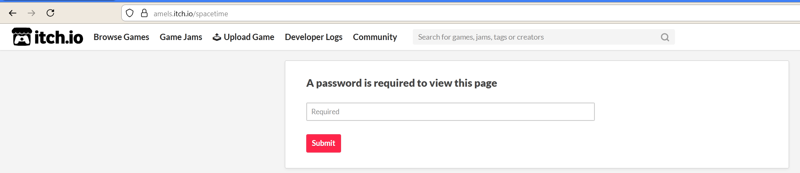
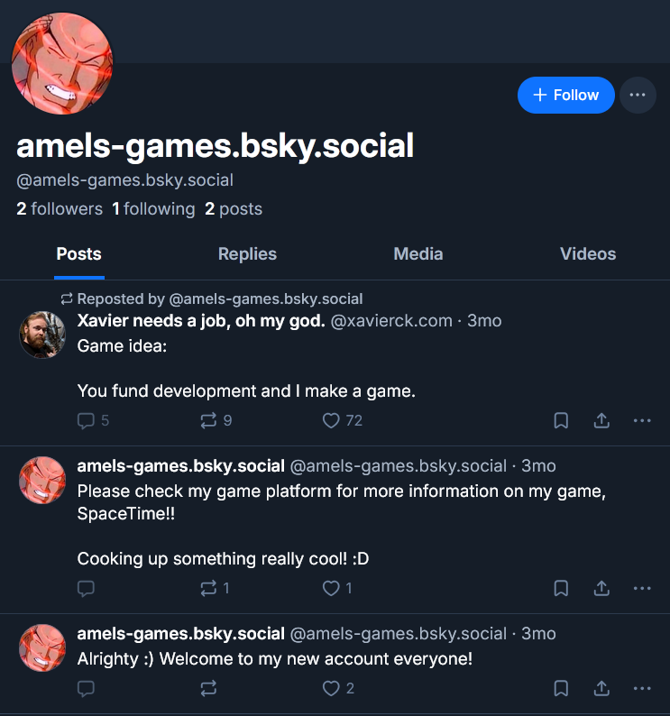
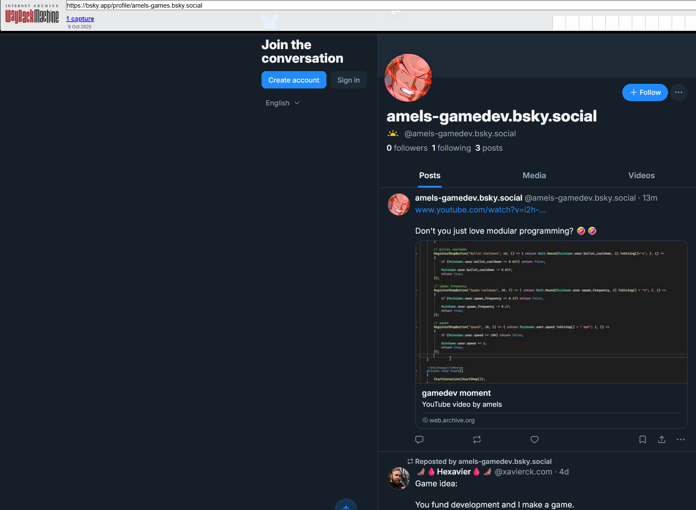
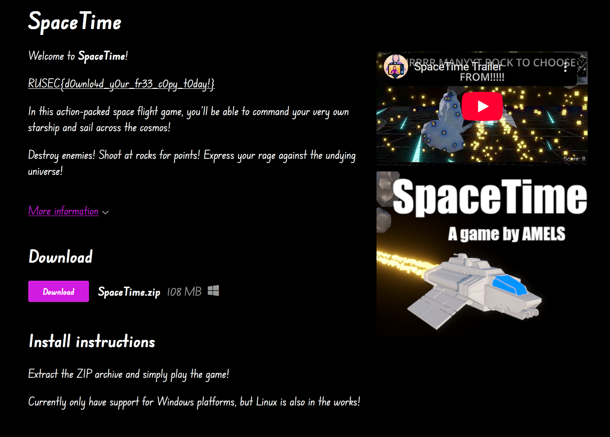

# MelStudios: Level0
### Category: MelStudios(Misc)
###### Description: Haii!! I need your help! >_>
###### There's this microcelebrity girlypop game developer called Amels I'm really fond of. I've been following her work EXTENSIVELY! on her social media!! (Call me a big fan)
###### (She hates alot of common social medias like Instagram, Twitter, etc., so it was really hard to find it >_<)
###### However, there's this new game that I really, REALLY want to play!! I've heard, from what she's been saying, that it's called SpaceTime, but I can't seem to find it anywhere! I'm not that much of an OSINT GOD like u seem to be, could u maybe help me figure it out? :c
###### Can you find the listing of the game and gain access to it? Pweeese!! I neeed to play it :(
###### Points/Solves: 494/10 Solves

### TL;DR - Just Give Me the Solve!
Find the SpaceTime itch page and Amels' bluesky page, look it up on an archive website, go to the youtube link and use the password in the hidden game page.

### Introduction
This challenge seemed like an interesting OSINT problem, which happens to be one of the things that I'm good at. With that being said, it's difficult as we have only one lead to go off of: Amel's itch.io page. This page only contains one game listing, which has been cancelled with no downloads. There are no posts on the page at all, and curiously no link to SpaceTime, the game mentioned in the description. 

### Finding SpaceTime
I first attempted to see if there were any archives of this page, but ultimately I found this really easily by just changing some stuff in the URL bar. The link to find any game is typically creatorsname.itch.io/GameName. In the case of Amels, the Timers game is on https://amels.itch.io/timers. So, in theory, if we went to amels.itch.io/spacetime it would pop up... and we get hit by a password page. 

Password protecting one's game in this manner isn't abnormal, and I've definetly run into it before. Oh well! I guess we need to see what other information we have to work with and proceed from there.

### Finding Amels Social Media
At this time I recalled that the description of the challenge mentioned that amels didn't have any *common* social media, which did mean that she probably had some on other websites. This (in hindsight) is confirmed bythe description mentioning that they follow them on social media. 
Ok, so no common social media. When someone says something like this, I immediately think of two platforms: Mastodon and Bluesky. There's also a few other oddball ones that I know about from when everyone said they were leaving Twitter (as it was called back then), but these two seem to have had some staying power. So, I decided to do a quick search on mastodon:

Ok, so I don't think Amels is a vtuber, so we're gonna move on to bluesky. A quick search there gave me a far more promising result a little down the list:

When I check the profile, it was the right one! It even had a skeet (I think that's what they call tweets over there) talking about SpaceTime. I guess this would've been the clue to try and find spacetime on the itch webpage, but I skipped over it. Ok, but where the heck am I going to find a password when there are only 3 posts on the account?

### The Internet Is Forever
At this point, I figured it had to be a deleted post or something like that - I know someone could have posted a password as sort of a "beta test" and then deleted it afterwards so people can't constantly get into it while it's being developed. So, I went back to the WaybackMachine and found a backup of the page there:

Huh, so it's a deleted youtube link? With a little fiddling around, I was able to get the full link and then open https://www.youtube.com/watch?v=i2h-eg75X4A in youtube. And while watching the video, an accidental paste caught my attention:

My immediate instinct was that this was an autogenerated password, and very likely the one I needed to get in. Trying it on the locked itch.io page shows me that it was in fact the password, granting me the flag `RUSEC{d0wnlo4d_y0ur_fr33_c0py_t0day!}`.

