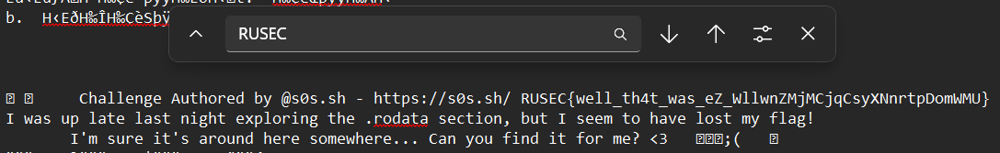

# First Steps
###### Description: Find the flag hidden in the binary!
###### Points/Solves: 

This is going to be a short writeup, as there was not any research I needed to do to solve this, and it was found in my general analysis steps.

### Solve
I opened the file in notepad (yes, really) and used ctrl+F to search for the flag format, "RUSEC". Upon doing that, it found a hit:

Submitted "RUSEC{well_th4t_was_eZ_WllwnZMjMCjqCsyXNnrtpDomWMU}" and it was accepted as correct.