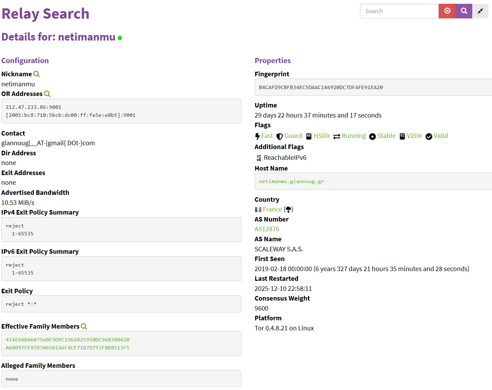

# Stuck In The Middle With You
### Category: OSINT
###### Description: We're trying to figure out how to track this Tor traffic but all we've got is this string, A68097FE97D3065B1A6F4CE7187D753F8B8513F5! We don't know what to do with it. We're looking for someone responsible for hosting multiple nodes. Can you find the IPv4 addresses this node and any of its effective family members?
###### Points/Solves: 168/378 Solves

### TL;DR - Just Give Me the Solve!
Look up the node on the TOR Relay search and find all effective family nodes.

### Introduction
This challenge seemed a little intimidating to me: I knew I could probably do it given the category, but I haven't dealt with tor or nodes at all. Thankfully, I was able to figure out how everything worked pretty easily. The first step, as with most challenges, is to do a little research

### Research
The first thing I wanted to see is if I could find a map of all the nodes, similar to how you can map out bitcoin transactions (I found out about that from another challenge in this CTF). So, I first did some googling around and stumbled upon a few lists of nodes. I was able to find the node on one of the lists, but it didn't mention anything about family members or links to other nodes. Given that, I figured I owed it to myself to google what family members are in the context of nodes but was a little confused. Ultimately, I just tried googling to see if there was a way to find the MyFamily ID through tor, and a reddit comment showed that there was a relay search on the official tor website. D'oh.

### Finding the nodes
So, first thing to do is start by searching up the original node I was given in the description.

I was a little relieved to find that it was there, and even more relieved when I saw a section that said "Effective Family Members" on the page, which in turn listed two other nodes. These were the two I pulled up:
 

Checking both of these nodes, I was able to confirm that there were no other nodes in the family, and thus I was able to solve by putting all of the nodes together from oldest to newest in the flag format. This gave me the correct flag of `RUSEC{212.47.233.86:51.15.40.38:151.115.73.55}`.
